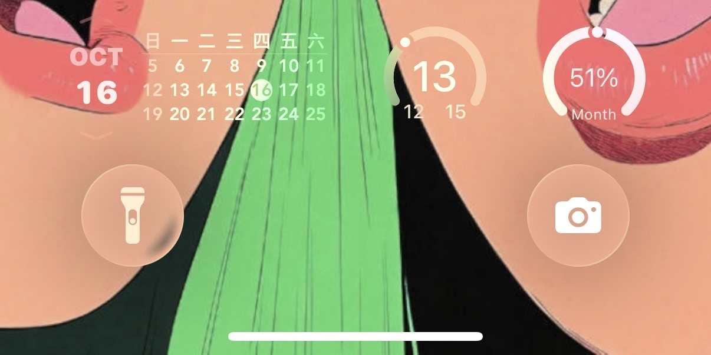
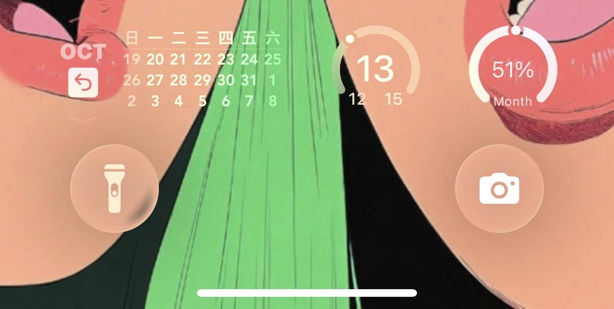
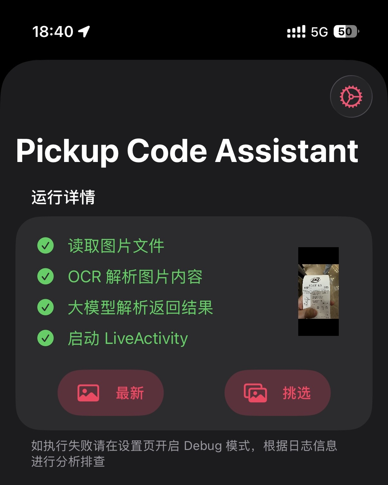
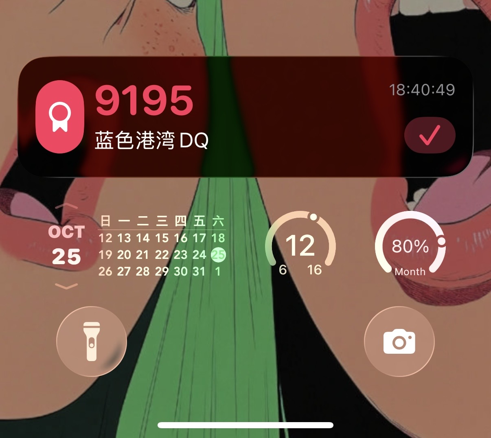

# Scripting

不定期分享使用 [Scripting App](https://scripting.fun/doc_v2/zh/index) 开发的小玩意儿～

## Calendar Widget

[点击安装](https://scripting.fun/import_scripts?urls=%5B%22https%3A%2F%2Fimarkr.com%2Fapi%2Fgithub%2Fdownload%2Fryanfwy%2Fscripting%2Ftree%2Fmaster%2Fscripts%2FCalendar%2520Widget.zip%22%5D)

|     |     |
| --- | --- |
|  |  |

一个可交互的日历锁屏小组件，可以上下翻页查看日期，以及返回当前日期。

## Pickup Code Assistant

[点击安装](https://scripting.fun/import_scripts?urls=%5B%22https%3A%2F%2Fimarkr.com%2Fapi%2Fgithub%2Fdownload%2Fryanfwy%2Fscripting%2Ftree%2Fmaster%2Fscripts%2FPickup%2520Code%2520Assistant.zip%22%5D)

|     |     |
| --- | --- |
|  |  |

### 介绍

我们在线下点餐的时候常常需要凭取餐码取餐，但是这些码嵌得很深，比如各家的点餐小程序，需要频繁切换来查看取餐码，十分繁琐。相似的场景还可能包括线下排队取号、取快递等。

所以这个脚本使用大模型来充当【**取码器小助手**】，通过截图或照片来解析取餐信息，再通过【**实时活动**】常驻来展示取餐码，方便随时查看。

### 使用说明

#### 执行入口

| 推荐 | 方式 | 优点 | 配置方式 |
| --- | --- | --- | --- |
| ⭐️⭐️⭐️ | 联动 Shortcuts 全自动截图并执行 | 无需手动截图，也无需保留一堆截图 | 1. 获取配套 Shortcuts [后台版](https://www.icloud.com/shortcuts/2e0709eaa10d42068fca683a776635ad) or [前台版](https://www.icloud.com/shortcuts/8f1d57435e2f461fbe52004494b79835) 2. 在控制中心添加 Shortcuts 3. 在取餐信息中下拉控制中心运行 Shortcuts，自动完成截图并执行 |
| ⭐️ | 手动截图，控制中心快速跳转执行 | 可以从相册挑选过去的图片 | 1. 在控制中心添加脚本为启动按钮 2. 在取餐信息中手动截图 3. 任何地方下拉控制中心跳转主应用，可以选择从「最新图片」或「相册挑选」中执行，支持设置启动后立即执行 |
| 🤡 | 手动截图，手动启动 App 执行 | 没有优点...不舍得占用控制中心 | 无需配置，按需使用 |

#### 实时活动管理

实时活动可以通过以下方式关闭：
1. 实时活动界面配置了完成按钮，点击后即可关闭活动
2. 系统也提供直接在锁屏界面左滑进行关闭，操作没那么便捷

### 你可能还想知道

#### 后台常驻

如果脚本在主应用内执行并成功展示实时活动，则需要保持应用后台常驻。当应用退出后台后，由于缺少运行环境实时活动展示的按钮可能会失效。

如果意外退出了应用后台，可能的修复步骤如下（视注册的 AppIntent 是否失效而定）：
- 再次启动主应用即可能恢复正常
- 仍未解决，需要打开「设置」并执行「构建脚本」，等待完成后恢复正常

以上问题只影响实时活动的完成按钮，不影响展示新活动等其他功能。如果不需要按钮功能可以无视，通过左滑进行关闭即可。

#### 入口设计

~~由于系统限制核心功能如 Vision、Live Activity 等 API 依赖应用后台常驻，因此所有入口都导向主应用执行。相应也有好处，因为大模型推理时间长，无 UI 执行进度不直观，而主应用提供了更丰富的信息方便了解运行详情，所以入口设计为只支持主应用执行。如果上述限制可以解决，也会更新一版无 UI 版本。~~

版本 >= 2.4.3(8) 所有核型功能均已支持 Shortcuts 后台执行，因此也提供了「后台版」和「前台版」两种执行入口（对应不同 Shortcuts 启动），可以根据喜好选择。
- 后台版：执行更方便，也不用担心按钮失效的问题
- 前台版：执行更直观，但应用退出后台后按钮可能会失效

#### AI 多模态

~~现在各家大模型都支持多模态版本，处理视觉问题效果要比纯文本强。目前 Assistant API 未支持传入图片，Workaround 是先对图片进行 OCR 提取文本再传入大模型，中间结果有精度损失并丢失了文本结构，比如错别字、理解不准确等。未来传图功能支持后会再更新一版，对于截图的理解和解析准确率会更高。~~

版本 >= 2.4.3(4) 已经支持，感谢开发者，起飞！！